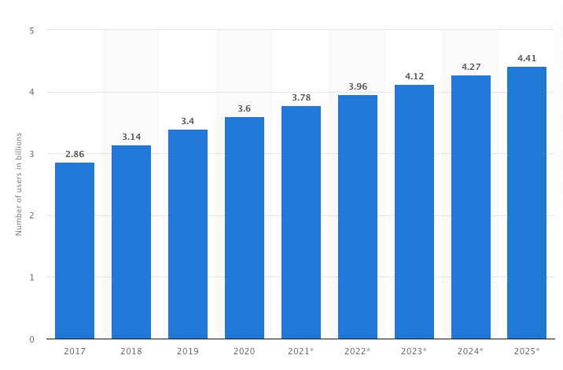
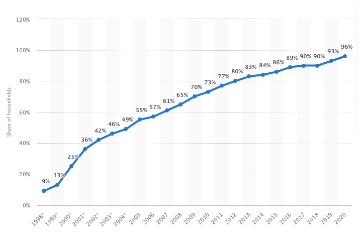
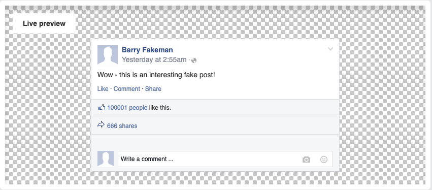

###  [<< Back to Landing Page](../README.md)

# Background and Motivation

## 2.1) Identifying and defining our problem 
### 2.11) Problem definition
Based on research collected from user surveys and background literature, our team identified a problem around the effects of social media on young people (aged 18 - 25). (for more information on our ideation process, please refer to the [UX design section](UXDesign.md)). We found that social media is very prevalent in today’s society, and in the lives of young people. It can be a force for good, but also comes with negatives; such as social media addiction. Therefore, our problem definition was narrowed down to a ‘How Might We’ statement:

> ## “How might we create a solution that aims to educate young people on social media in an engaging and entertaining way?”

([source](https://www.designkit.org/methods/3))

### 2.12) Scope of project

#### Technical Scope:
From a technical perspective, our **Minimum Viable Product (MVP)** includes making use of the **MEAN** stack (refer to [System Implementation](SystemImplementation.md)) to send information from the database and on to the webpage, and vice-versa. Our MVP includes being able to store and receive sentences in the form of Fakebook posts, either from fake users (the bots) or created by the user. The user is able to interact with the site by creating their own Fakebook posts, and reading through a large array of posts. The posts from the bots must be created randomly and be semi-believably human.  
#### Design Scope:
Our design scope includes having 2 pages - a ‘Home’ page where the posts could be viewed, and an ‘About’ page detailing information about our project. On the ‘Home’ page, we would create individual names and profile pictures for the bots, and include different-coloured factboxes which are cited in between posts, to educate the user about social media. There are visual ‘likes’ and ‘comment’ buttons, but it was not within the scope of this project to implement functionality with these, so they are merely for aesthetic purposes. 

### 2.13) Challenges 
#### The challenges of our problem:
* **Reliability and breadth of information collected:** Due to factors such as time constraints and the pandemic, our team is limited in the amount and availability of information available to us. This is true in both our primary and secondary research - we do not have the time to collate academic information on the scale we would like, and do not have the time and resources available to conduct in-depth user studies. This is why we aim to target our research around small sample sizes. 
* **Large global issue, one small solution:** Our product aims to tackle an issue that is pervasive in all regions of the world, and affects people from a range of ages and nationalities. However, our scope aims to mitigate this - we have narrowed down our user group to young people, and part of our success criteria is defined in how these users of our webpage interact with it - as long as our users gain something positive from our webpage, our project can be deemed successful. 

## 2.2) Secondary Research

Social media use has exploded in the last few years, and is on course to continue this trajectory. The number of worldwide social media users in 2021 is 3.78 billion people (approximately half the world’s population), with it set to increase every year (see Figure 1) ([Source](https://www.statista.com/statistics/278414/number-of-worldwide-social-network-users/)). 

  
**Figure 1.** Projected increase in worldwide social media usage.

Social media was initially defined as “web-based services that allow individuals to (1) construct a public or semipublic profile within a bounded system, (2) articulate a list of other users with whom they share a connection, and (3) view and traverse their list of connections and those made by others within the system.” ([Source](https://ebookcentral.proquest.com/lib/bristol/reader.action?docID=1143700)) However, today that definition fails to capture the complex and multi-functional ecosystems of the big social media sites. There are now lots of different types of media (eg video, photograph, text) shared over these social networks, as well as a dizzying array of content. Social media has become a manifestation of the moods and trends of contemporary society. For example, it is possible to predict the movement of the stock market ([Source](https://pdfs.semanticscholar.org/119c/375a81588c5576644a56705a6b7a987592db.pdf)) and when an influenza outbreak will occur ([Source](https://ieeexplore.ieee.org/document/5928903)) using solely the content of social media posts, which is quite scary! 

As the internet is global, and therefore has no centralized governing body, these social media sites have traditionally had ‘low levels of regulation’ ([Source](https://ebookcentral.proquest.com/lib/bristol/reader.action?docID=1143700)) put in place to enforce rules around their use. This is constantly evolving however, as different countries put into place restrictions over what types of content can be consumed by their citizens. For example, the recent ban of Facebook by the Australian government over a proposed law which would enforce the tech giant to have to pay news publishers for content ([Source](https://www.bbc.com/news/world-australia-56165015)). China is another country which is known for putting into place bans on Western social media sites, such as Google, Facebook and Twitter ([Source](https://www.nytimes.com/2018/08/06/technology/china-generation-blocked-internet.html)).

The number of uses we have for social media has increased rapidly over the last few years. “The average person has 8.6 social media accounts in 2020, up from 4.8 in 2014” ([source](https://backlinko.com/social-media-users)), and the social media model has been applied, very successfully, to everything from the job market (eg LinkedIn) to dating sites (eg Tinder, Grindr). The evolution of social media has definitely caused problems as its power and influence have grown along with it. This has led to difficulties surrounding its regulation, and how best to educate people about using it responsibly. 

  
**Figure 2.** Share of households with internet access in the United Kingdom (UK) from 1998 to 2020 ([Source](https://www.statista.com/statistics/275999/household-internet-penetration-in-great-britain/#:~:text=Household%20internet%20penetration%20in%20the%20United%20Kingdom%20(UK)%201998%2D2020&text=Following%20two%20consecutive%20years%20at,highest%20it%20has%20ever%20been.))

As the internet becomes cheaper and more accessible ([source](https://www.ons.gov.uk/peoplepopulationandcommunity/householdcharacteristics/homeinternetandsocialmediausage/bulletins/internetaccesshouseholdsandindividuals/2020 )) (see Figure 2), children are having access to it, and consequently social media, from an earlier age. This is a new and complex issue. It is estimated that 95% of children aged 10 - 15 speak to people online ([Source](https://www.ons.gov.uk/peoplepopulationandcommunity/crimeandjustice/bulletins/childrensonlinebehaviourinenglandandwales/yearendingmarch2020#:~:text=Estimates%20from%20the%20Crime%20Survey,years%20spoke%20to%20people%20online.)). Research has shown that there can be benefits, with social media access in children and adolescents enhancing communication, social connection, and even technical skills ([Source](https://www.cooperativa.cl/noticias/site/artic/20110329/asocfile/20110329173752/reporte_facebook.PDF)) ([Source2](https://files.eric.ed.gov/fulltext/ED536072.pdf)). However there are areas of huge concern, such as its effect on mental health and a lack of education about how to use social media safely. For example, 1 in 25 children said they had spoken to someone on social media who they believed to be their own age, but later found out were much older ([Source](https://www.ons.gov.uk/peoplepopulationandcommunity/crimeandjustice/bulletins/childrensonlinebehaviourinenglandandwales/yearendingmarch2020#:~:text=Estimates%20from%20the%20Crime%20Survey,years%20spoke%20to%20people%20online.)). Also, half of 12 - 15-year-olds say they have seen something hateful about a particular group of people online in the last year ([Source](https://www.ofcom.org.uk/__data/assets/pdf_file/0023/190616/children-media-use-attitudes-2019-report.pdf)).

The highly addictive mechanisms employed by social media sites are well documented. The infinite scroll has been compared to pulling a slot machine lever. Features such as ‘likes’ activate the reward system in the brain, which releases chemicals that cause us to feel pleasure. This sensation can be addictive, particularly in young people, who have more active ‘reward circuitry’ than adults. 22% of teenagers log on to their favorite social media site more than 10 times a day, and more than half of adolescents log on to a social media site more than once a day. ([Source](https://pediatrics.aappublications.org/content/127/4/800)) Addiction is a definite cause for concern: children spending more than three hours a day on social media are twice as likely to suffer from poor mental health ([Source](https://www.ons.gov.uk/peoplepopulationandcommunity/wellbeing/articles/morechildrenusingsocialmediareportmentalillhealthsymptoms/2015-10-20)).

Social media’s effect on mental health is complex. For example, social media can be a great channel for keeping in contact with friends and family. For young people who use social media sites such as Facebook, receiving a nice comment was shown to ‘increase the student’s self-confidence’ ([Source](https://www.sciencedirect.com/science/article/abs/pii/S0747563216300887?casa_token=ewkWhsSFS9EAAAAA:wRL_aemYW04OEviyZQQ64GrnjDiYQhMizAOLZVtzpPnT0wCqnycEXW_HTOaGs5Z3vmANSQuQdAiF)). Furthermore, when looking at their own profile on Facebook, it was shown that ‘a brief exposure to one’s own profile increased self-esteem.’ ([Source](https://www.tandfonline.com/doi/full/10.1080/15213269.2012.762189?casa_token=6O3nM9eXKOwAAAAA%3Aijst9st5m0X3rsmzeV6zulnZi47RT0ZVYgNSQTbfqkXf9OoJfbOlMTGvsUxC_3oTeQNswlWEddNlU_I)). However, there are also negative effects of using these sites that young people may not be conscious of. For example, a study showed that after young people were passively browsing on Facebook compared with passively performing other activities, they reported lower moods. Social media use was also shown to decrease cognitive task performance, and lower student’s overall grades ([Source](https://www.tandfonline.com/doi/full/10.1080/15213269.2012.762189?casa_token=6O3nM9eXKOwAAAAA%3Aijst9st5m0X3rsmzeV6zulnZi47RT0ZVYgNSQTbfqkXf9OoJfbOlMTGvsUxC_3oTeQNswlWEddNlU_I)) ([Source2](https://d1wqtxts1xzle7.cloudfront.net/40319725/The_Effects_of_Social_Media_on_College_Students.pdf?1448349994=&response-content-disposition=inline%3B+filename%3DThe_Effects_of_Social_Media_on_College_S.pdf&Expires=1616974146&Signature=IrbfyjDv-ypFB3kEfDoWdkoE4colS6QSRd2l0hAjpy8zGzjm0oznwy4E~-N3QVOL9VSxO9QlqYuBS~qSkQ0zRN-9cGKesWYQT-0kbKbxpfnhHRK-ARG-PnVLpnGgRhQ-Z7jQH1LbSUgldg0YTxxfNWPuacLuN9P~i-InsFn0uLOZkZDpI5wWUmZwON2SfJBsnHfa6FRRAf6psC6iMDU6igygC6iKfZyKHAw7mxeCrLv9PkRyANo-ViRXN-croXjSVt4cGfbhMBwdzZSOl08aQlMaIrq6NVv-uWGpF1y8zEc0bHEbvIzZp7ZvJcI7sDbm6SG46DyGkxH3O5R~iYUC2g__&Key-Pair-Id=APKAJLOHF5GGSLRBV4ZA)). 

Another interesting example of the impact of social media is its role in the spread of negative news and information. Such rapid spreads of negativity have been coined ‘online firestorms’ and refer to the phenomenon in which any negativity towards a brand, politician or celebrity spreads very quickly. ([Source](https://www.tandfonline.com/doi/full/10.1080/13527266.2013.797778?casa_token=Vcr6BjzdtcoAAAAA%3AxPryRTrexz93_beqVIzBoHe9pXNWEcL_GM0XTO35NVVFakDzEn-t0_iyOvPPCcSuPX5PjToV-siD7eQ&)) ([Source2](https://dl.acm.org/doi/abs/10.1145/2817946.2817962?casa_token=cQ8Gnls9uMUAAAAA%3A41CUwmqBudxYMX7xP0ksqwyqTnyrQDLacQGqrrqxyIzazulDtF3BhEs_DYdjkNtJgNgPdpbJOlGj9Qg)) ([Source3](https://www.tandfonline.com/doi/full/10.1080/08838151.2017.1309414?casa_token=LzvvSJluq_8AAAAA%3AiNquVoNLtmRK4nrt4KoLJKMTvG2kQNYmTd5ZdbNhhCFw1lZu5zIZRioFdPRmDizD7JaKl4efnHVYfLE)). This is a huge problem as it becomes increasingly difficult to tell if this negative news is based on fact. Especially as more and more people turn towards social media as their main source for news. In America, social media has now outpaced Newspapers as a primary source of news ([Source](https://www.pewresearch.org/fact-tank/2018/12/10/social-media-outpaces-print-newspapers-in-the-u-s-as-a-news-source/)). It has been shown that fake news spreads more quickly and deeply via social media than real news stories, with this effect being most pronounced in political fake news ([Source](https://science.sciencemag.org/content/359/6380/1146)). Obviously the ramifications of this can be severe, if these effects are exploited, as they supposedly were during the U.S. presidential elections in 2016 ([Source](https://www.aeaweb.org/articles?id=10.1257/jep.31.2.211)).

It is clear from our literature review that social media’s influence and power is enormous and poorly regulated. It is also something that affects the vast majority of the population, with that amount growing all the time, making it highly topical. It seems easily justifiable, therefore, to use social media as the focus of our scrutiny for this project. Furthermore we have identified some areas of particular concern about social media, that we can aim to address with our product:
1. younger users’ relationship with it, and its effect on their mental health
2. the difficulty in verifying authenticity of content on it
3. the lack of education about how to use it responsibly
4. its addictive nature 

With these in mind, perhaps our site can make a difference by raising some awareness of the complex issues, both positive and negative, that surround social media and allowing users to make more informed choices in the future.

## 2.3) Current Industry Review 
Based on our current industry review, we have concluded that there is only one other application on the market that seems to solve a similar issue to that of Fakebook. Most fake social media applications appear to only be used for entertainment purposes, or for creating fake social media content to ‘prank’ friends.

### 2.31) Apps for entertainment 
Fake social media applications that are used solely for entertainment purposes include the website [PrankMeNot](https://www.prankmenot.com/) (See figure 3). This claims to be used for pranking your friends into thinking that a certain person has posted something to Facebook or Twitter. There are other applications that perform a similar function but for other forms of social media, for example imitating Yahoo answers and Whatsapp Messenger ([Source](https://techwiser.com/fake-social-media-generators-web-mobile/)). There is also the fake social media site (of the same name), [Fakebook](https://appsliced.co/app?n=fakebook-your-fake-social-media-app), which allows you to become fake friends with celebrities, and message them. These sites are primarily for comedic effect, taking advantage of the addictive qualities of social media, or using it to spread false content to friends. 

  
Figure 3. A fake post generated by PrankMeNot

Next section:

### [3) UX Design](UXDesign.md)
