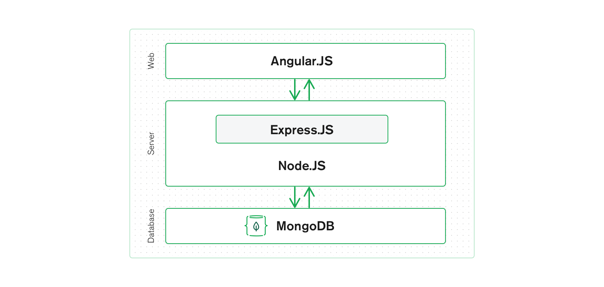
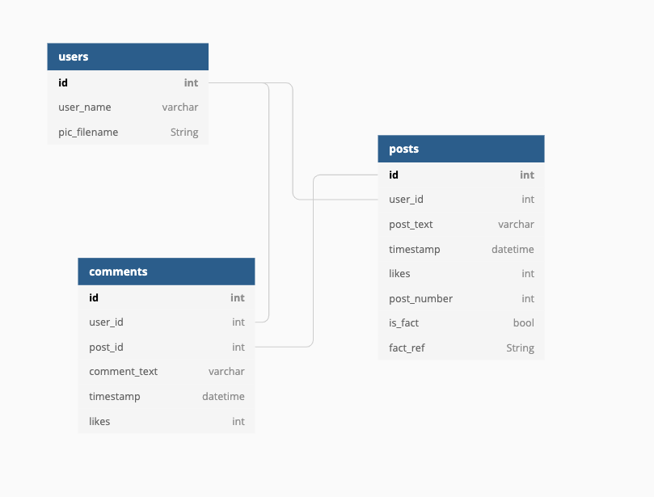
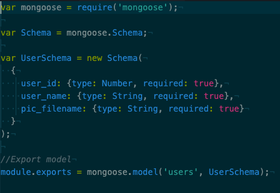
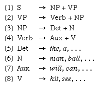

# 4) System Implementation

###  [<< Back to Landing Page](../README.md)

### [<< Previous Section](UXDesign.md)

## 4.1) Stack Architecture and System Design

)  
Figure 1. MEAN stack logo ([Source](https://en.wikipedia.org/wiki/MEAN_(solution_stack)))

Our product was developed using the MEAN stack architecture:
- **MongoDB** - database
- **Express** - Node.js web framework
- **Angular** - a client-side JavaScript framework
- **Node** - JavaScript web server

This framework allows for full-stack JavaScript development, ensuring ease of data transfer between sections. In theory it would allow us to quickly and efficiently turn our designs into a working prototype. For details of the specifics of our use of each part of the stack and justifications for our decisions, please consult the respective section that follows.

Figure 2. A diagram of the MEAN stack's architecture ([Source](https://www.mongodb.com/mean-stack))

## 4.2) Front End: Angular 

Planning:

We decided that the best way to implement the Minimal Viable User Experience was via the so-called “divide and conquer” strategy. The main problem would be divided into subproblems/features which would then be further subdivided. Each feature would be implemented and unit tested separately before merging with the rest of the code. This satisfied the principle of continuous integration (i.e., constantly merging between branches to avoid internal conflicts). The final Minimal Viable Product would serve as a “scalable foundation” such that more complex/ambitious features should be implemented above it without heavy code refactoring. 
 
Development Tool:
 
According to the plan, our development tool must satisfy the following criteria:
 
- It must allow heavy object orientation which enables “divide and conquer”.
- It must allow easy unit testing
- It must be strongly typed so that more bugs can be caught at compile rather than runtime.
- It must be a web development framework that reduces code refactoring.
 
We chose Angular as the web development framework for our MVP as it coincides well with the above criteria. Angular has its own code structure. Instead of using JavaScript for user interaction, Angular opts for TypeScript, the superset of JavaScript that allows strong typing. Before runtime, the Angular compiler converts TypeScript into JavaScript, which reduces runtime bugs.
 
We divided our source code into multiple Angular Components. They strongly resemble classes in object-oriented programming languages, making them perfect for scaling up the size of the product. They are essentially reusable and customizable HTML tags that render corresponding features on the web page. This allowed us to break down our index.html to just several lines of custom tags, each of which was also broken down in the same fashion.

The Angular Routing property was also used as it allowed more efficient management of Components’ lifecycles. It replaces the Hyperlink in vanilla HTML with RouterLink, which only loads/refreshes the required features, rather than the entire page.Unit testing of our Angular code was easily achieved via Jasmine and Karma, Angular’s built-in testing tool.
 
**Challenges:**  
It was unexpected how steep the initial learning curve of Angular would be. More than 50% of our total front end development time was spent learning Angular’s own way of handling data binding between script and HTML, and also the HTTP requests from front end to back end. 
 
The hardest problem we faced was that Angular fetches the data from the back end and renders the web page asynchronously by default. However, our product required the data to be fetched before rendering. To resolve this problem, we used the Angular Resolver, which blocks the rendering until data had been fetched.
 
**Short Summary:**  
Despite the drawbacks, overall we still believe that Angular was the correct choice for front end development. An alternative would have been React, which has a much flatter initial learning curve. However, it has a much more open and complex ecosystem with numerous frameworks in charge of different responsibilities. It would be much more time-consuming to select the correct frameworks via trial and error. Overall, opting for Angular was the efficient choice.

## 4.3) Back End: MongoDB
We decided to use MongoDB for our data storage due to the fact that Node, Angular and Express allow for full stack development using JavaScript, so consequently are designed to work very fluidly with JSON (JavaScript Object Notation) files. Considering MongoDB stores its data in a ‘JSON-like’ format, it seemed like a sensible choice of NoSQL database for us to use. It was also a simple task to make our post generator output a JSON file, which we could then automatically import into MongoDB on spinning up our Docker containers. 

### 4.31) Data Model
We designed our data model in such a way that it would be easily scalable. We opted for a normalized data model, as opposed to an embedded one, due to the fact that the volume of data that we were storing was unlikely to be great enough that we would notice the performance improvements of the embedded model ([Source](https://docs.mongodb.com/manual/core/data-model-design/)), and we decided that clarity and simplicity outweighed those marginal performative gains anyway. We were all more familiar with relational databases, so modelling our data in this way made the transition to NoSQL easier. Also having the data as normalized as possible meant that we could edit the contents of one collection, without having to totally reinsert all of the data, which was helpful as we scaled up the amount of content and the number of users throughout development. This model also allowed us to deliver all of the data fields required for populating the news feed in one query, albeit from multiple collections, generating one JSON payload per get request from the API. 

Our data model naturally evolved as we honed in on which features our MVP was going to include, following feedback from users and following discussion with the team members responsible for the front end and middle tier. 

  
Figure 3. Our data model, including a ‘comments’ collection which didn’t end up being implemented as part of our MVP. 

### 4.32) Schemas
We chose to interact with the database from the middle tier using mongoose, as it provided a simple and clear schema based JavaScript interface with MongoDB from Node. Our API was then able to query the database for the required data, and also add items into the database as necessary. Mongoose schemas have the added bonus of allowing built-in data validation, which was very useful for adding items back into the database, as it bypassed the need for extra validity checks.

  
Figure 4. An example schema for one of the collections in our database.

### 4.33) Seeding the Database
Our site required some data to be present in the database upon building the docker-containers, as posts needed to be populated immediately upon visiting the page. This posed an unexpected, but significant challenge, as it turned out to be much more difficult and time consuming than we’d envisaged to automatically seed the database. Our first thought was to edit the docker-compose file to include a step that would load in the data as JSON files, but we ran into issues to do with Mongo not yet being running in the container. We then tried using a bash script similar to the one used to wait for the connection between the containers to wait until Mongo was up and running, but this too proved to be complicated. We also tried seeding via a temporary extra docker container, but still to no avail. Eventually we settled on adding the data using mongoose from within a JavaScript file that is run whenever the containers are started, checks whether there is data present in the database, and adds the data if not.  

## 4.4) Middle Tier: Express and Node
To connect our front-end to our database, we used the frameworks Express, Node and an API. 

Initially before connecting the database, we tested that our data could be pulled from a dummy data file, and displayed on our web page. This ensured a skeleton structure was in place before implementing our HTTP requests. 

**Get and Post requests:**  
We used the framework Express, which allows us to handle multiple HTTP requests from a specific url. To pull data from the database, we made use of HTTP requests, specifically get and post. 
- Our get request allowed us to query the database and pull a random sample size of our specification onto the API. The get request was used to pull data from both the ‘post’ schema in the data model, and the ‘user’ schema. Therefore, the username can be selected and filled into the frontend during run time. 
- Our post request allows the user to send their own ‘post’ back to our database, where this is stored permanently, and becomes a part of our stored data, ready to be potentially pulled again on another get request. 

As they were not necessary for our MVP, we did not make use of put and delete requests (which could have been used to implement the functionality of the ‘like’ and ‘comment’ buttons being stored back to the database). 

## 4.5) Additional Elements: Content Generation

One of the biggest technical challenges we faced was trying to generate grammatically correct sentences for our bots’ posts. It was a difficult decision about how to proceed as we wanted something which was relatively simple, but which generated content that made enough sense to keep users engaged and amused. We also wanted to be able to have some degree of control over the topics of the generated content.

There were several different paths we considered taking. The first was using Markov Chains. A Markov Chain is a mathematical model that uses probabilistic rules to determine which state it will transition to. Its defining characteristic is that the probability of transitioning to any state is dependent solely on the current state and time elapsed ([Source](https://brilliant.org/wiki/markov-chains/)). They have been applied successfully to modelling language ([Source](http://people.math.harvard.edu/~ctm/home/text/others/shannon/entropy/entropy.pdf)) as they can be ‘trained’ by feeding in bodies of text and recording a matrix of each word, along with all the words that occur directly afterwards. You can quickly generate a sentence by starting at a word and randomly choosing one of the possible words that can occur after it. The benefits of this are that the generated sentence can have the ‘style’ or ‘tone’ of the piece of text that it has been trained on. For example there is a twitter account that uses markov chains on tweets scraped from the top 100 twitter accounts to generate new tweets ([Source](https://twitter.com/markovtop100)), or another site that uses a markov chain to generate Donald Trump-esque speeches ([Source](https://medium.com/@corrigan1247/how-to-imitate-trump-with-markov-chains)). It is also flexible and quick. The downside however, and ultimately the reason that we decided not to use Markov Chains is that they are not guaranteed to produce syntactically correct sentences. We felt that it would undermine our bots’ believability too greatly, and take away from the serious element of our site if the random content made absolutely no sense.

   
Figure 5. An example tweet from @MarkovTop100, illustrating the style of sentence generation possible using Markov chains, but also illustrating the unrealistic post content achieved by such a method ([Source](https://twitter.com/MarkovTop100/status/743034391752900609)). 

Another option was to use a pre-built machine learning algorithm or API. There is some amazingly sophisticated sentence generation software out there, such as ‘Generative Pre-trained Transformer 2’ (GPT-2) ([Source](https://d4mucfpksywv.cloudfront.net/better-language-models/language-models.pdf)) ([Source](https://openai.com/blog/better-language-models/)). However, it seemed like overkill to use something so powerful for such simple text generation. Also the style of the text can be unpredictable, as it uses an enormous corpus from across the internet. Some of the output appears to be more akin to prose than the informal social media tone we were looking for. This seems to be the case with a lot of off-the-shelf content generating software, as the majority of it is designed to produce long form text ([Source](https://minimaxir.com/2019/09/howto-gpt2/))

Instead we opted for a much simpler approach, based on the phrase structure rules first proposed by Noam Chomsky in 1957 [9]. They essentially involve breaking natural language into its constituent sections, or ‘phrasal categories’, which can be effectively visualized as a sentence tree. A basic example would be breaking a simple sentence (S) into 2 constituent parts, a noun-phrase (NP) followed by a verb-phrase (VP). A noun-phrase consists of an optional determiner (Det) such as ‘the’, followed by a noun (N). The noun can then be optionally preceded by an adjective-phrase (AP) or followed by a prepositional phrase (PP). A verb-phrase is constructed of a verb and optionally an adverb ([Source](http://217.64.17.124:8080/xmlui/bitstream/handle/123456789/557/syntactic_structures%20(1).pdf?sequence=1)) ([Source](http://www.colinphillips.net/wp-content/uploads/2015/09/chomsky1965-ch1.pdf)).

 
Figure 6. Diagram of the basic components of a phrase ([Source](https://www.britannica.com/science/linguistics/Historical-diachronic-linguistics)).

[11] “Chomsky’s Grammar”, Encyclopedia Britannica. Accessed: April. 16, 2021 [Online]. Available: https://www.britannica.com/science/linguistics/Historical-diachronic-linguistics

[12] N. Chomsky, "Three models for the description of language," IRE Transactions on Information Theory, vol. 2, no. 3, pp. 113-124, September. 1956, doi: 10.1109/TIT.1956.1056813.

[13] “Phrase Structure Rules”, Wikipedia. April. 16, 2021. Accessed: April 27, 2021 [Online]. Available: https://en.wikipedia.org/wiki/Phrase_structure_rules  

[14] B. Rodriguez. “The Most Popular Celebrities on Instagram in 2021” Yahoo Finance, March. 30, 2021. Accessed: April 28, 2021. [Online]. Available: https://finance.yahoo.com/finance/news/top-10-most-followed-celebrities-195102901.html

[15] B. J. Jansen, K. Sobel, and G. Cook, “Gen X and Ys’ attitudes on Using Social Media Platforms for Opinion Sharing,” Extended Abstracts on Human Factors in Computing Systems, CHI EA ’10, (New York, NY ,USA), p. 3853–3858, Association for Computing Machinery, 2010. Accessed: April 27, 2021. [Online]. Available doi: 10.1145/1753846.1754068

### [>> 5) Sprints and Project Management](SprintsAndProjectManagements.md)
